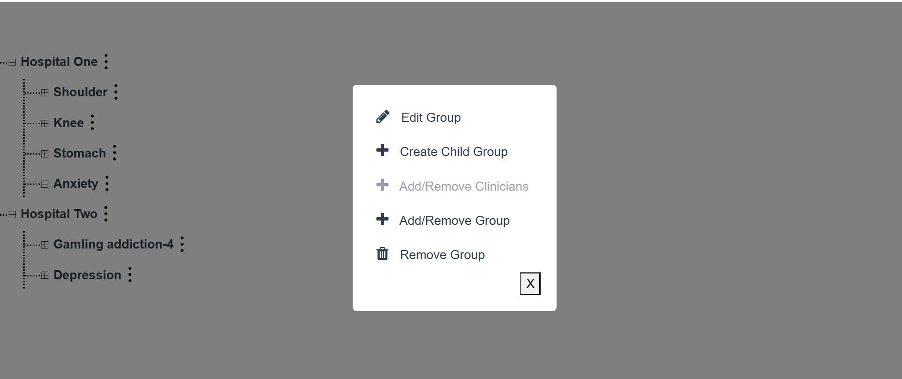
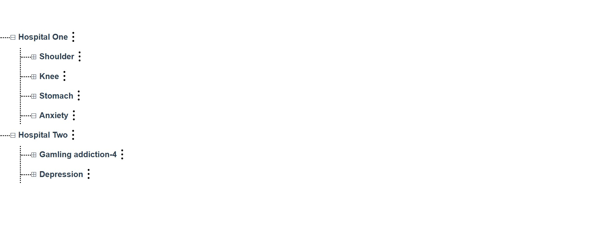

# vue-project
It is sample application with vue.js

## Table of Contents
- [Introduction](#introduction)
- [Features](#features)
- [Installation](#installation)
- [Usage](#usage)


## Introduction
This app helps visualize a parent-child tree structure and provides functionality to add, delete, and update nodes within it.

## Features
- Edit Group
- Create Child group
- Add/Remove Clinician
- Remove group
- Drag and drop nodes 

## Installation
1. Clone this repository:
    ```bash
    git clone https://github.com/arpitha723/vue-project.git
    cd vue-project

 2. Install dependencies:
    ```bash
    npm install   ```

 3. Run the development server:
    ```bash
    npm run serve 

 4.  Open your browser and visit `http://localhost:8080`.

## Usage

1. After running the app, you'll see the home page with tree strucure of parent and child node .
2. Each node will display based on lazy loading 
3. Create a new child group by clicking on 'Create Child Group'.

4. Edit Group group name by clicking on Edit Child group.

5. Add/Remove Clinician and Remove Group will take you to another screen where you can add or remove the child

6.You cannot delete a child group that has more than one child group. In such cases, you will see an error notification

7. You can use searchbar to check for the children

8.Can Arrange the node by dragging and drop the child


``
## Demo Screenshots
Here’s a preview of the app:






### Customize configuration
See [Configuration Reference](https://cli.vuejs.org/config/).
